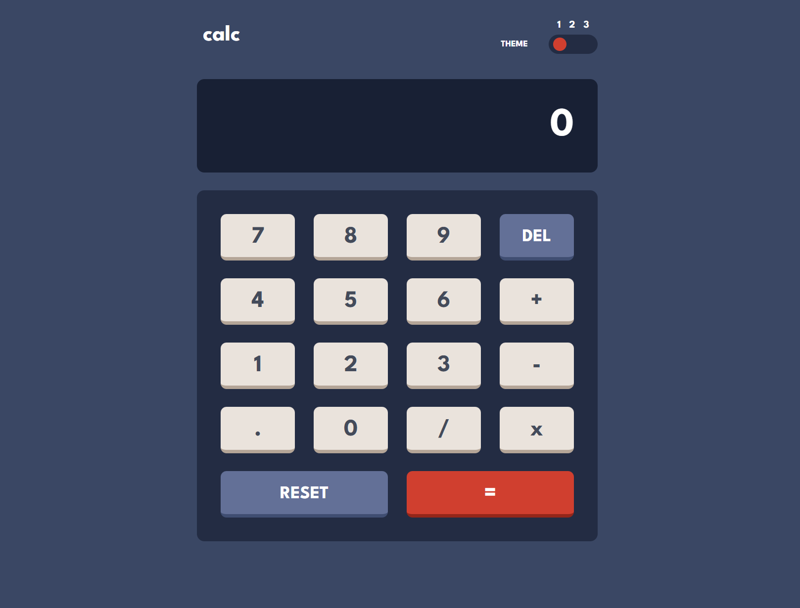

# Frontend Mentor - Calculator app solution

This is a solution to the [Calculator app challenge on Frontend Mentor](https://www.frontendmentor.io/challenges/calculator-app-9lteq5N29). 

## Overview

### The challenge

Users should be able to:

- See the size of the elements adjust based on their device's screen size
- Perform mathmatical operations like addition, subtraction, multiplication, and division
- Adjust the color theme based on their preference
- Have their initial theme preference checked using `prefers-color-scheme` and have any additional changes saved in the browser

### Screenshot

### Links

- Solution URL: [Add solution URL here](#)

## My process

### Built with

- Semantic HTML5 markup
- CSS custom properties
- CSS grid
- JavaScript
- JavaScript regular expressions
- Keyboard support
- Implemented without using eval()

### What I learned

This was a great project to practice implementing a 3-colour theme switcher. I used `prefers-color-scheme` and local storage to ensure the selected theme would remain upon a page refresh. 

I learned more about using complex regex to add in a thousands separator, and to split the expression string into an array of numbers and operators. One difficulty I had was how to recognise negative numbers. I solved this using a lookbehind assertion to check whether the character preceeding a negative symbol was a number or operator.

A key focus was to implement this without using the problematic eval() function, and to manually evaluate the expression using BEDMAS.

### Continued development

In the future I would like to rebuild this with React. I would also like to write test cases, as all my testing was done manually.

### Useful resources and acknowledgments

- [The Odin Project](https://www.theodinproject.com/lessons/foundations-calculator) - This helped me think through some of the potential issues when building a calculator.
- [typeofnan](https://typeofnan.dev/how-to-add-thousandths-place-comma-every-three-digits-in-javascript/) - This article helped me to consider using regular expressions. Although this solution didn't work for this project, it gave me the seed of thought! I also used W3Schools and MDN Web Docs for further understanding.
- [Javascript Calculator with Keyboard Input](https://codepen.io/thecountgs/pen/JReGNR) - This was a good reference project. It uses var so I would assume it is quite old, but it gave me a start of where to look to implement keyboard support for the project. This was also where I got the idea of having a boolean variable to manage the state of using a decimal point.

## Author

- Website - [Helen Emmett](https://helenemmett.co.nz/)
- Frontend Mentor - [@HelenEmmett](https://www.frontendmentor.io/profile/HelenEmmett)